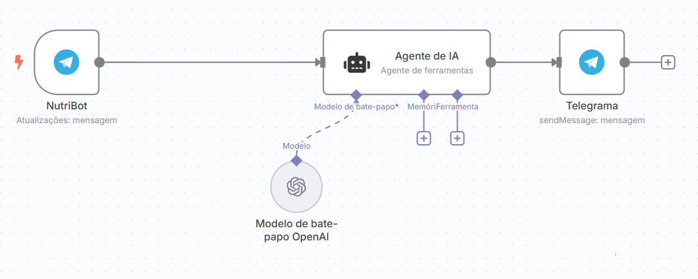

## 🤖 NutriBot – Chatbot Nutricional com IA no Telegram
Este projeto é um chatbot nutricional automatizado desenvolvido com o n8n, que utiliza o Telegram para interação com o usuário e a OpenAI (GPT-4o-mini) para fornecer respostas inteligentes e personalizadas sobre alimentos e nutrição.
---
## 📌 Visão Geral
O NutriBot é um assistente virtual para responder dúvidas nutricionais com base em alimentos informados pelo usuário. Ele retorna as informações nutricionais de 100g do alimento citado, com destaque para:

- Calorias

- Proteínas

- Gorduras

- Carboidratos

- Vitaminas e Minerais

- Indicação para diabéticos e hipertensos

- Melhor forma de consumo em casos de doenças
---

## ⚙️ Funcionalidades
- 📥 Recebe mensagens via Telegram

- 🧠 Processa o conteúdo com um Agente de IA configurado com sistema de instruções específico para atuação como nutricionista

- 💬 Gera a resposta com o modelo GPT-4o-mini da OpenAI

- 📤 Retorna a resposta ao usuário no próprio Telegram

---

## 🧩 Componentes do Workflow

| Etapa               | Descrição                                                                     |
| ------------------- | ----------------------------------------------------------------------------- |
| `NutriBot`          | Gatilho via Telegram: inicia o fluxo ao receber mensagem                      |
| `AI Agent`          | Agente de ferramentas do LangChain com sistema de instruções de nutricionista |
| `OpenAI Chat Model` | Modelo `gpt-4o-mini` usado para gerar respostas contextuais                   |
| `Telegram`          | Envia a resposta gerada de volta ao usuário                                   |


---
## 🚀 Como usar

1. Clone este repositório:

```
git clone https://github.com/seu-usuario/NutriBot-n8n.git

```

2. Importe o arquivo My_workflow.json na sua instância do n8n:

- Acesse https://app.n8n.io

- Vá para Workflows > Importar

- Selecione My_workflow.json

3. Configure as credenciais:

- Conecte sua conta do Telegram

- Conecte sua API Key da OpenAI

4. Ative o workflow

Após configurar tudo, ative a automação e teste enviando mensagens ao seu bot no Telegram.

---
## 📸 Interface
Veja como o fluxo foi construído no n8n:


---

## 📚 Requisitos
- Conta no Telegram

- Conta na OpenAI

- Instância do n8n (pode usar n8n.cloud ou auto-hospedado)

---
## 🧠 Inspiração
Esse projeto foi pensado para oferecer acesso facilitado à informação nutricional, com linguagem clara e personalizada, ajudando pessoas com necessidades específicas como diabetes e hipertensão a fazerem melhores escolhas alimentares.

